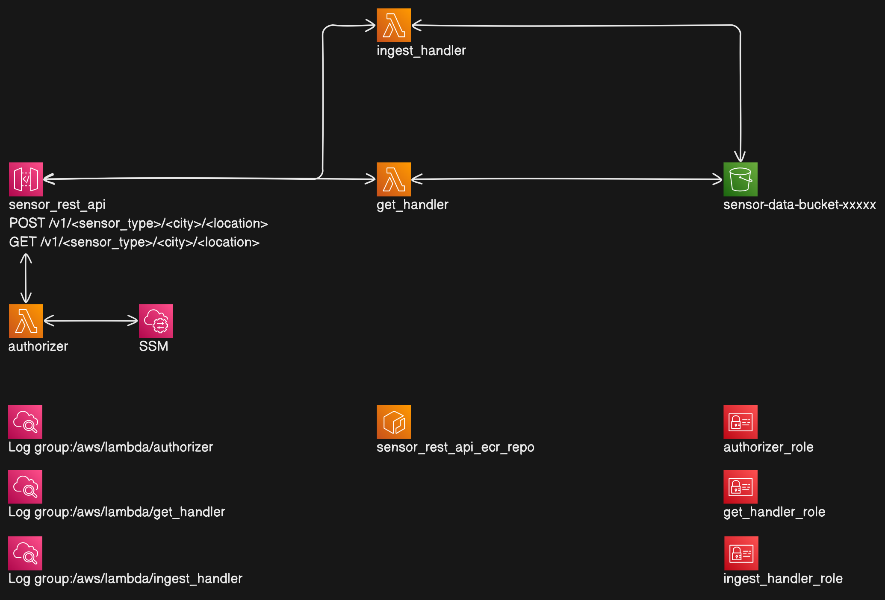

# CitySense

A public API for connected cities.


## Introduction

Hello and thank you for taking the time to review my code. I really enjoyed this project and I am grateful for the oppurtunity to join PlayQ!

## Constraints, Assumptions and Focus

My biggest constraint was time, since I have a full time job and a family. So I treated this project like an mvp or proof of concept, that I could show my team and get buy in for the general technical approach.

I created a prioritized list of tasks that I would like to accomplish next ([see Next Steps](##next-steps)).

With that being said, I decided to focus on four things:

1. core api functionality including basic auth
2. simple infrastructure definitions and setup
3. simple ci/cd workflow
4. unit testing

I did not focus on implementing production-ready requirements or best practices ([see Next Steps](##next-steps)).

## Architecture



## Getting Started

If you would like to run the CI/CD workflow in your own Github repo and deploy the infrastructure to your own AWS account then follow these steps.

### prerequisites

Due to time constraints, I decided to use IAM User Access Keys to provide permissions to the CI/CD instead of setting up the prefered OpenId provider.

So in a sandbox AWS account, create an AWS IAM Admin User and generate access keys for this User. We will use these credentials for our Github workflow.

Set these keys as your default profile on your local machine (used for bootstrapping).

You will also need a Github account.

### 1. Clone the repo and remove git tracking

```bash
git clone git@github.com:cgradwohl/terraform_api_lambda_python.git

cd terraform_api_lambda_python

rm -rf .git
```

### 2. Bootstrap the remote backend for terraform

From the root directory run the following bash command in your terminal.

```bash
chmod +x ./bootstrap.sh

./bootstrap.sh
```

Press enter to use the `us-west-1` region or specify another valid region.

This script will accomplish two things for you:

- 1. It will deploy an S3 bucket, a DynamoDB table and IAM Policy required for Terraform to manage the state of the infrastructure.

- 2. It will write the terraform configuration for terraform/ecr/backend.tf and terraform/api/backend.tf.

### 3. Push the repo to Github

Create a new remote repository on github. Name it `playq_chris_gradwohl`.

Push this project to your new remote repository:

```bash
git init
git add .
git commit -m "hello!"

git remote add origin git@github.com:<your_github_username>/playq_chris_gradwohl.git
git branch -M main
git push -u origin main
```

### 4. Configure Github Secrets

On first push, the workflow should fail due to missing access keys.

Use the access keys from the IAM User you created in the [prerequisites](###prerequisites) section and add them as secrets in the github repository.

(From the github repo) Settings > Secrets and variables > Actions. Then click New repository secret button.

Create `AWS_SECRET_ACCESS_KEY` and `AWS_ACCESS_KEY_ID` secrets.

Finally re-run the workflow.

### 5. Invoke the API

Obtain the invoke_url from the `Deploy (App Infra) with Terraform` action of the `Deploy App Infra` job.

Or visit the AWS console to get the `sensor_rest_api` stage url.

## Next Steps {#next-steps}

Here is my thought process to improve the code base, developer workflows and get ready to go to production.

1. Standardize dependency management.
   To save time I manually managed all dependencies, but I would like to add more robust and safe dependency management tooling like Poetry or bash scripts.
2. Finish unit testing handlers, lib and terraform.
   I ran out of time to complete this, but I was able to add a few basic tests.
3. Setup OpenID connect permissions and remove aws access keys.
4. Add handler e2e tests and provision a test environment.
5. Create Terraform modules for Lmabdas, API Gateway and IAM to reduce duplication and improve best practices.
6. Setup multi stage configuration and deployments.
7. Setup Lambda versioning, aliasing to enable trivial rollbacks.
8. Add failure destinations for API Gateway, and Lambda handlers.
9. Setup API metrics and alerting.
10. Improve CI/CD to run faster and only when necessary.

## Potential Feature's Roadmap

- Pagination Feature
- GET by Longitude and Latitude and proximity
- Configuration Service

## Conclusion

Thank you again for reviewing my work and giving me the oppurtunity!

If you have any questions or concerns please don't hesitate to reach out to me via email: `christophergradwohl@gmail.com`
